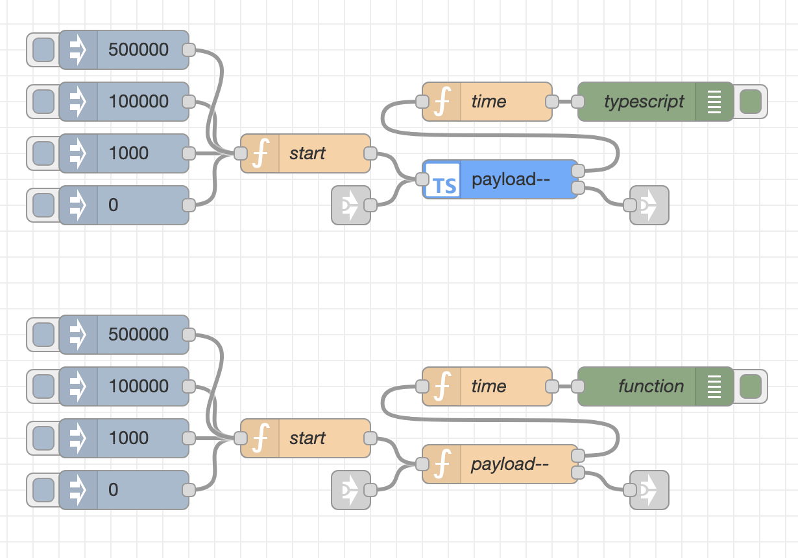
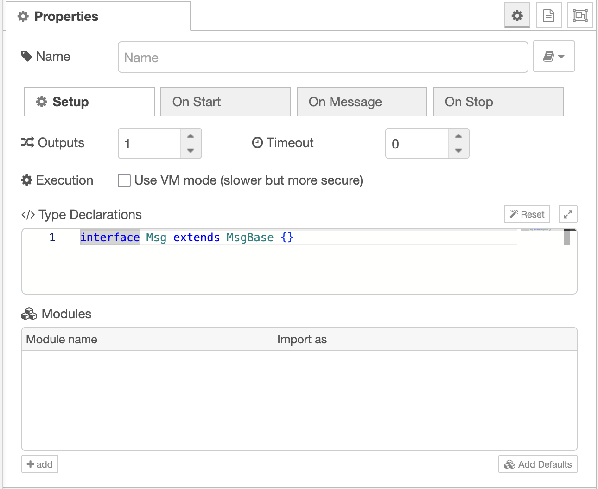
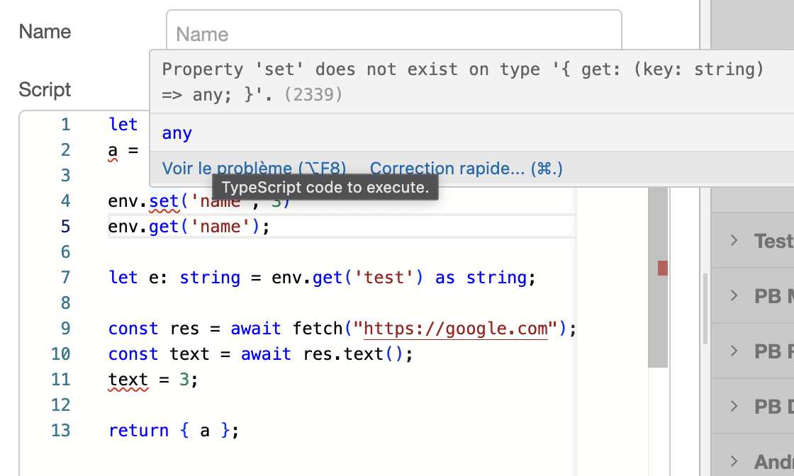

# Node-RED TypeScript Node

A fast TypeScript execution node for Node-RED with Monaco editor, type checking, and multi-tab configuration.

## Installation

Install via Node-RED palette manager by searching for `node-red-contrib-ts`

Or via npm:
```bash
npm install node-red-contrib-ts
```

## TypeScript Node

Execute TypeScript code directly in your Node-RED flows with full type checking, modern JavaScript features, and multi-tab editor interface similar to the standard Function node.

### Features

- **Monaco Editor** - Same editor as VS Code with syntax highlighting and IntelliSense
- **TypeScript Support** - Full TypeScript compilation with error checking
- **Multi-Tab Interface** - Separate tabs for initialization, main function, and cleanup code
- **Custom Type Declarations** - Define your own TypeScript interfaces and types
- **External Module Support** - Import npm modules with type safety
- **Async/Await Ready** - Your code runs in an async function context
- **Multiple Outputs** - Route messages to different outputs
- **Two Execution Modes** - Function mode (fast) or VM mode (secure)


### Performance Benchmark

Benchmark results for 500,000 executions:
- **Node-RED function node**: 11,886ms
- **TypeScript node (Function mode)**: 6,177ms - **1.9x faster**
- **TypeScript node (VM mode)**: 10,222ms - **1.2x faster**



### Available Context

Your TypeScript code has access to these variables:

- `msg` - The incoming message object
- `node` - The current node instance for logging
- `RED` - Node-RED API
- `global` - Global context storage
- `env` - Environment variables via `env.get('VAR_NAME')`
- `fs`, `path`, `os`, `crypto`, `util`, `Buffer` - Node.js modules
- `fetch` - HTTP client for API calls
- `process` - Process information

### Usage

**API call with custom types:**
```typescript
// Type Declarations tab
interface ApiResponse {
    data: {
        id: number;
        name: string;
        status: 'active' | 'inactive';
    }[];
    meta: {
        total: number;
        page: number;
    };
}

interface NodeMessage {
    payload?: {
        userId: number;
        filter?: string;
    };
}
```

```typescript
// On Message tab
try {
    const apiKey = env.get('API_KEY');
    const { userId, filter } = msg.payload;
    
    const response = await fetch(`https://api.example.com/users/${userId}/data`, {
        headers: { 'Authorization': `Bearer ${apiKey}` }
    });
    
    if (!response.ok) {
        throw new Error(`API error: ${response.status}`);
    }
    
    const apiData: ApiResponse = await response.json();
    msg.payload = apiData.data.filter(item => 
        filter ? item.name.includes(filter) : true
    );
    
    return msg;
} catch (error) {
    node.error(error.message);
    return null;
}
```

### Configuration

The TypeScript node provides the same functionality as the standard Function node but with TypeScript support and enhanced features:

#### Editor Tabs

- **On Start** - Code executed once when the node starts (initialization)
- **On Message** - Main function code executed for each incoming message  
- **On Stop** - Code executed when the node is stopped or redeployed (cleanup)

#### Setup Tab

- **Type Declarations** - Define custom TypeScript interfaces and types
- **External Modules** - Import npm modules with automatic type definitions
- **Outputs** - Number of outputs
- **Timeout** - Execution timeout in milliseconds
- **Execution Mode** - Function mode (faster) or VM mode (more secure)



### Editor Features

- **IntelliSense** - Auto-completion for available context variables with precise type definitions
- **TypeScript Validation** - Real-time error checking with Node-RED context awareness
- **Smart Error Filtering** - Automatically ignores await/return errors for seamless Node-RED integration
- **Syntax Highlighting** - Full TypeScript syntax support
- **Template Code** - Helpful starter template for new nodes



The editor provides comprehensive TypeScript support with:
- **Type checking** for all Node-RED context variables (`msg`, `node`, `env`, etc.)
- **Automatic filtering** of context-specific errors (await/return statements work seamlessly)
- **Real-time validation** as you type with precise error messages and suggestions

## License

This project is licensed under the Apache-2.0 License - see the [LICENSE](LICENSE) file for details.

You are free to use this software in commercial environments, modify it, and distribute it without requiring to share your modifications.

## Acknowledgments

Special thanks to [@sheng-ri](https://github.com/sheng-ri) for the [fork](https://github.com/sheng-ri/node-red-contrib-ts) that contributed important fixes and improvements including:
- No declare-error check on close.
- Fixed duplicate type definition issue.
